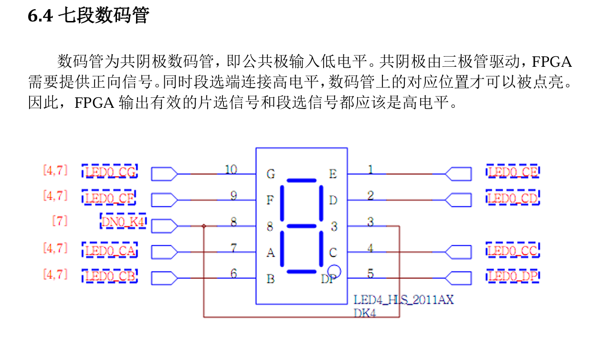
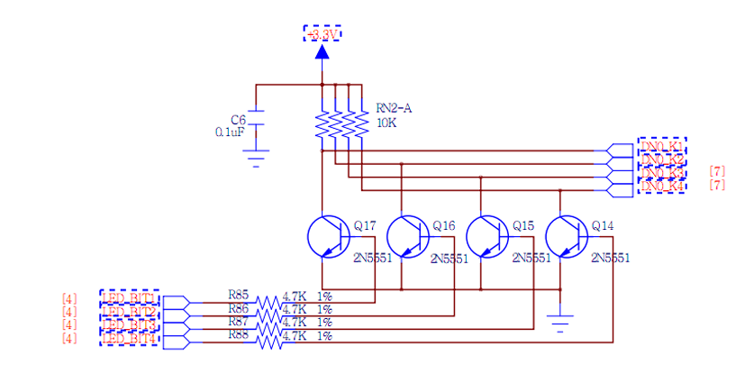
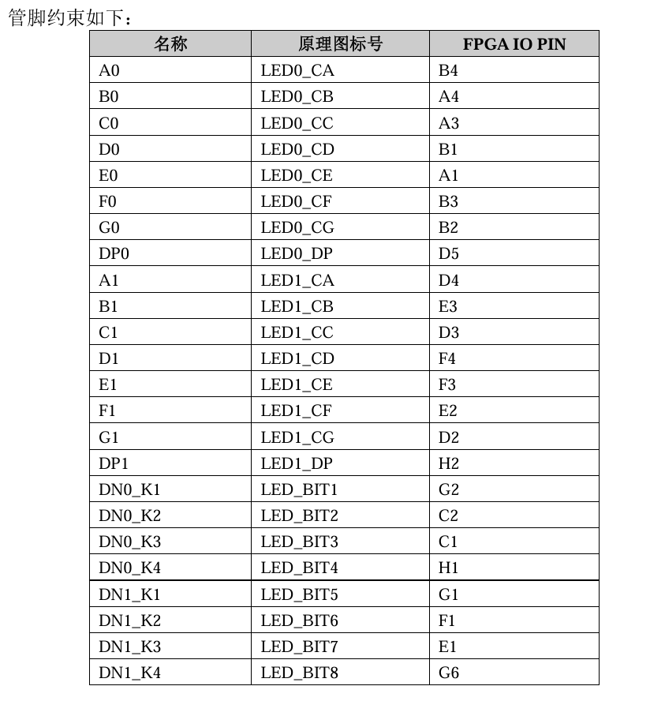
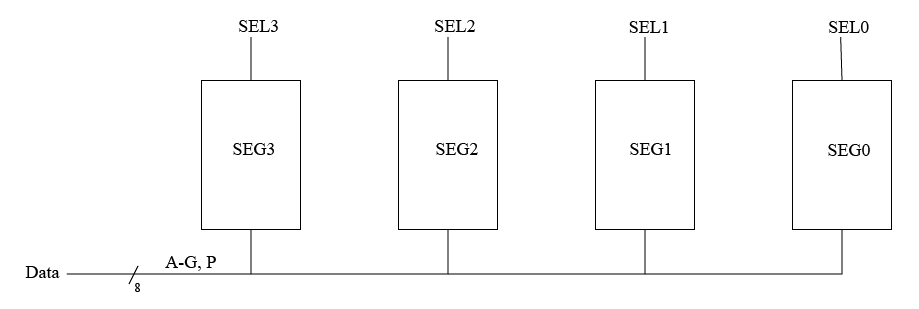
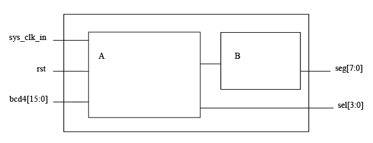

# 如何同时驱动8个数码管

> by zeronx

## 原理解释

由手册，不难得到：

- 数码管分为两组，一组 4 个，共 8 个。
- 数码管由两组信号驱动，一组为 **片选信号** ， 另一组为 **数据信号** 。
- 片选信号共 4 位，每位对应一个数码管，且片选信号为独热码格式，一次只能拉高一位。
- 数据信号控制 7 段数码管和一个小数点是否亮起，高电平为亮。
- 当片选信号和数据信号同时为高电平，对应位置数码管的特定段才会点亮。

因此，我们可以将一组数码管抽象为如下的模型：

其中，SEL4-0 对应片选信号，Data 对应数据信号。后文均使用本图的代号。

## 实现方式

上文提到，片选信号一次只能拉高一位，如果使用不变的片选信号，那么只能驱动一个数码管。

如果想一次驱动4个管子，那么就要让片选信号 *动起来* 。片选信号激活哪个数码管，就给 Data 送上对应的数据。

片选信号的高电平在4个数码管之间变化，就能依次激活每一个数码管，当片选信号切换的速度较快时，人眼的视觉暂留效应就会将闪烁的四个数码管看作同时点亮。

当然，片选信号的变化速度不宜过快，否则会受到板上电路的限制，导致无法正常显示。

若想同时驱动两个数码管，只需实例化两个上面的模块，将它们的数据信号连在一起就可以了。

## 示例

下面给出一个示例架构图，仅供参考。

其中，端口有：

- `sys_clk_in` 为时钟输入
- `rst` 为复位
- `bcd4` 为4个4位的bcd数字，可以自行拓展。
- `seg` 为 **数据信号**
- `sel` 为 **片选信号**
  
模块分工如下：

- `A` 实现选择逻辑。每隔固定的一段时间，选择bcd4中的4位，同时激活对应的片选信号。
- `B` 实现BCD到数码管上字段的译码器。
