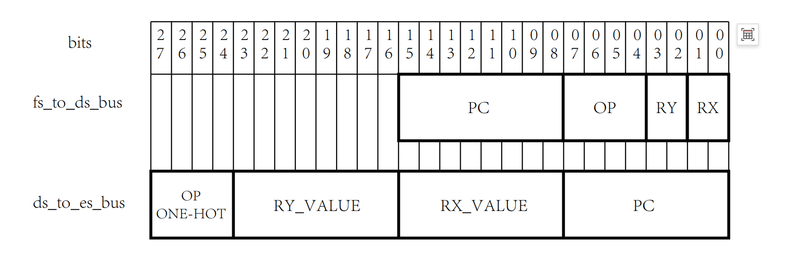
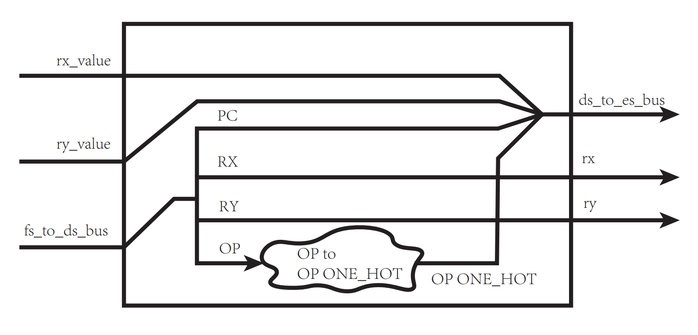
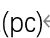
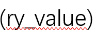
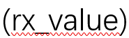
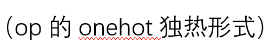
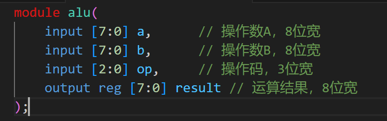
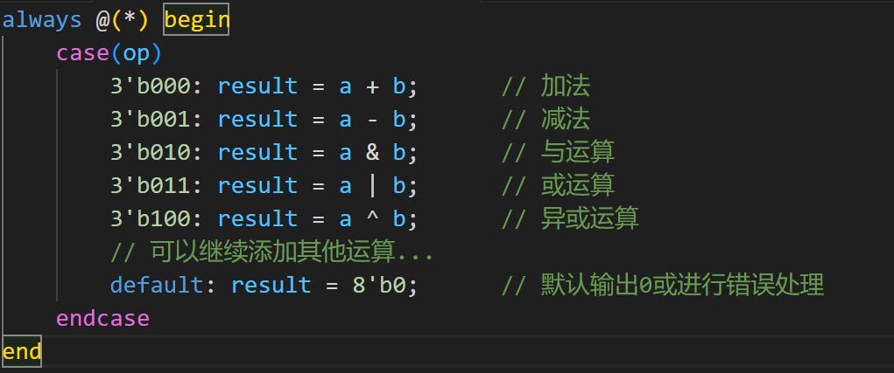
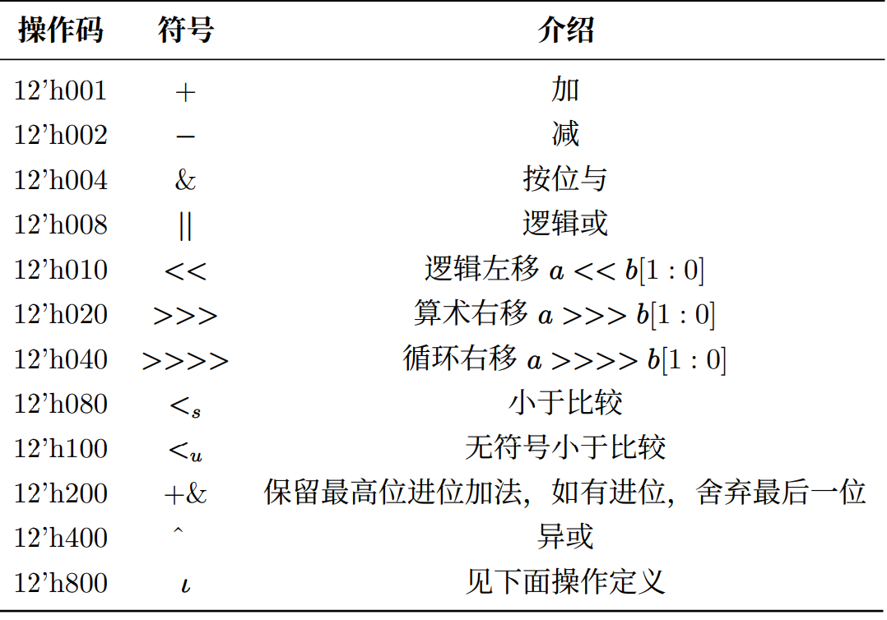
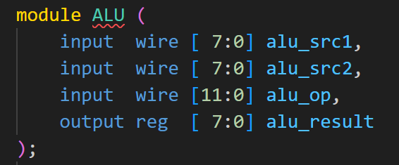

# CPU译码器和ALU到底是干什么的？

> by 袁汉青 计科233

## CPU译码器是干什么的？

答：CPU译码模块负责将取指阶段从存储器中读取的指令进行解析，转换成计算机内部可以直接执行的微操作或控制信号。

### 译码器基本功能

具体来说：位于取指阶段之后，接收从指令寄存器（IR）中读取的指令，再对这些指令进行解码
。

### 译码过程举例

这里先我们举一个最最最基础简单的例子作为说明。

假设CPU正在执行一条加法指令，该指令的二进制代码为xxxx yyyy
zzzz（这里为了简化，用x、y、z代表不同的二进制位）

其中xxxx是操作码，表示这是一条加法指令；yyyy和zzzz是操作数地址或立即数。

**输入信号：** 译码模块的输入信号主要是从指令寄存器（IR）中读取的指令代码xxxx
yyyy zzzz。

**处理步骤：**

1.解码操作码：解析出指令的操作码xxxx。

2.提取操作数信息：解析出操作数地址或立即数yyyy和zzzz。如果操作数是寄存器地址，就进一步从寄存器文件中读取相应的寄存器值。

3.设置控制信号：设置一系列的控制信号，指导后续的执行单元

**处理结果：**

控制信号输出：输出一系列的控制信号，例如加法器的使能信号、操作数选择信号、结果寄存器写入信号等。

数据准备：供执行单元使用。

执行准备：一旦所有必要的控制信号和数据都准备就绪，CPU就可以进入执行阶段，执行加法运算。

### 举例（可以跳过，直接看Lab2译码器解析）

我们先不举lab2的例子，先看一个实际指令集的例子。这里大家只要理解译码器工作性质，不必关注代码细节。

假设我们设计一个基于RISC-V指令集的CPU（指令集可以不用管，有余力的同学可以查阅资料了解），我们关注其中R型指令和I型指令的译码。R型指令和I型指令的格式如下：

R型指令：opcode[6:0], rs1[4:0], rs2[4:0], funct3[2:0],
funct7[6:0], rd[4:0]

I型指令：opcode[6:0], rs1[4:0], funct3[2:0], rd[4:0],
imm[11:0]

我们来设计一个译码模块，该模块能够接收32位的指令，并解析出指令中的各个字段，包括

**操作码（opcode）** **源寄存器索引（rs1、rs2）**
**目标寄存器索引（rd）**

**功能码（funct3、funct7）立即数（imm，仅I型指令）**。

Verilog代码示例：

上面是一个简化的例子，方便大家理解如何根据指令类型解析出不同的字段。实际设计中，需要考虑更多指令类型和更复杂逻辑来处理。

### Lab2译码器解析

先看这两个图

图1

图2

我们对照着看：

图二左侧显示有3个输入，两个操作数(rx_value和ry_value)，一个其他模块到译码模块的信息流（fs_to_ds_bus）。其中fs_to_ds_bus在模块内被拆成三个数据子片段（Rx，Ry，Op，Pc）。rx_value、ry_value、OP、Pc被用于生成输出也就是从译码模块到其他模块的信息。我们举例说明：

假设输入为：

rx_value=10101010

ry_value=10010010

fs_to_ds_bus=0001 0001 0001 0001

fs_to_ds_bus被拆成：

PC：00010001

OP：0001

RY：00

Rx：01

这些子块被重新拼接为ds_to_es_bus ：

 ds_to_es_bus：1000 10101010 10010010
00010001

其余rx=00、ry=11也作为输出。

到这里，相信大家已经能够完全理解译码器的工作原理了。

## ALU是干什么的？

### ALU的功能

答：一言以蔽之，执行各种算术和逻辑运算。ALU就是执行CPU中所有算数和逻辑操作的部件。

### ALU的工作流程

下面我们以一个最最最简单的ALU模块为例，说明其输入信号、处理步骤和处理结果。

**输入信号**

ALU的输入信号通常包括两个操作数（例如A和B）和一个操作码（例如OP），用于指示ALU执行哪种运算。

**处理步骤**

ALU根据操作码选择相应的运算逻辑，对输入的操作数A和B进行处理。处理步骤通常在always块或组合逻辑中完成。

**处理结果**

ALU将运算结果存储在result寄存器中，通过输出端口提供给其他部件使用。在上面的例子中，result寄存器存储了A和B根据操作码进行运算后的结果。

总的来看：ALU是执行算数和逻辑运算的核心部件，通过接收输入信号（操作数和操作码），根据操作码选择相应的运算逻辑进行处理，并将处理结果输出给其他部件。

### Lab2举例

 图一
 图二

我们先看图：

图一：操作码决定操作。这里注意操作码每一位都是2的次方，说明是独热码。

图二：规定输入输出格式。

假设：

操作码：0000 0000 0010

操作数1：10101010

操作数2：00010001

操作码为2，说明运算是减法。10101010-00010001=10011001。这就是alu_result。

到这里，大家也都对ALU有了明确的了解。

!> 来自助教的提醒：请勿抄袭，违纪者严肃处理！
