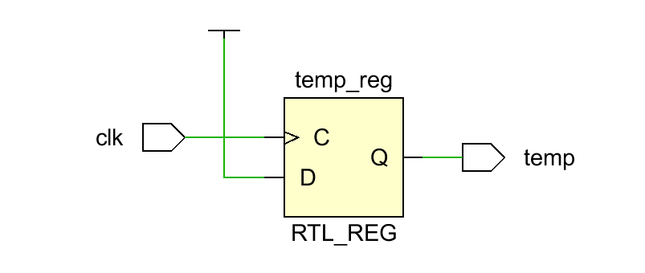
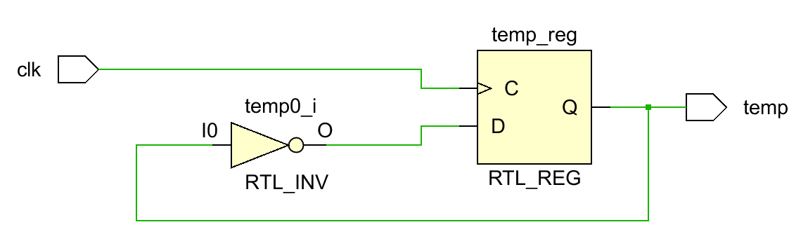
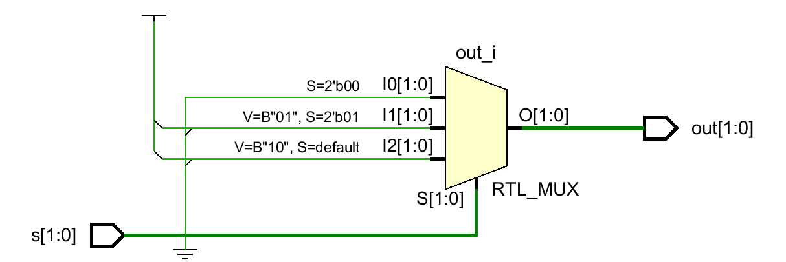
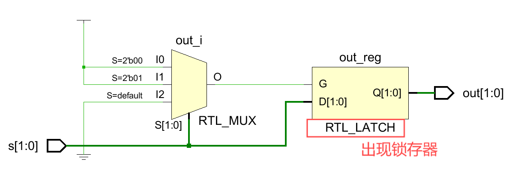
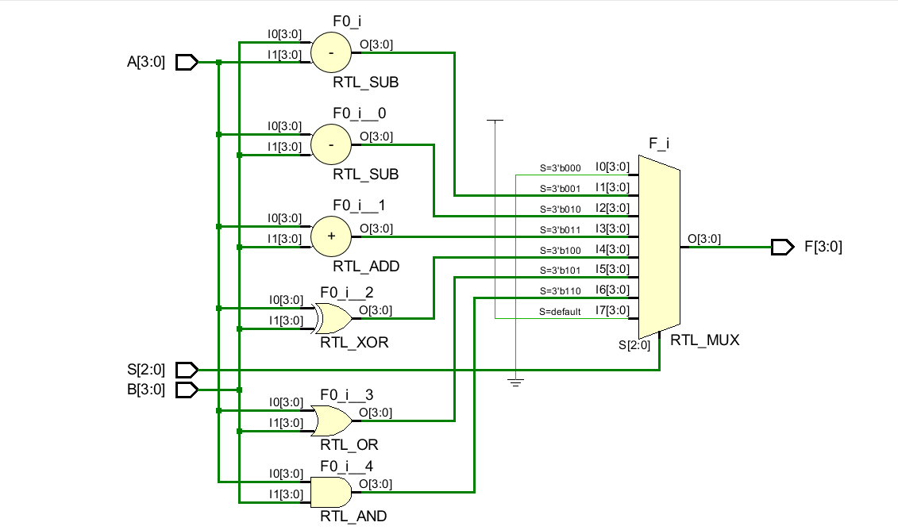
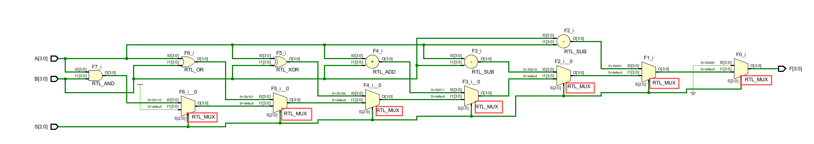
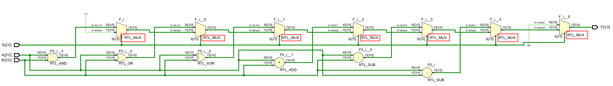
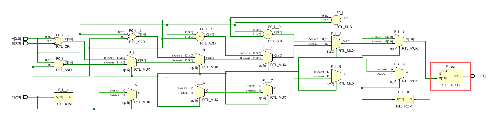

# 从简单 ALU 设计学习 Verilog 组合逻辑电路

> by 黄灿

> **ALU (Arithmetic and Logic Unit)** ，
> 算术逻辑单元，是能实现多组算术运算和逻辑运算的组合逻辑电路。  
> **组合逻辑电路** ，
> 任意时刻的输出仅仅取决于该时刻的输入，与电路原来的状态无关。
> *--==无记忆存储功能，对输入立即反馈==*  
> **Verilog HDL (Hardware Description Language)**
> 一种硬件描述语言，每条语句对应生成一部分实际硬件电路。
> 由于是描述语言，语句之间是并行关系（组合逻辑），只有单个语句块内部（时序逻辑）为顺序执行。

___

## 设计如下功能的简单 ALU（4 位操作数）

| Operation | Inputs<br>$S_2S_1S_0$ | Outputs<br>F |  *注释*  |
| :-------: | :-------------------: | :----------: | :----: |
|   Clear   |         0 0 0         |   0 0 0 0    |        |
|   B - A   |         0 0 1         |    B - A     |        |
|   A - B   |         0 1 0         |    A - B     |        |
|    ADD    |         0 1 1         |    A + B     |        |
|    XOR    |         1 0 0         |   A XOR B    | *异或操作* |
|    OR     |         1 0 1         |    A OR B    |  *位或*  |
|    AND    |         1 1 0         |   A AND B    |  *位与*  |
|  Preset   |         1 1 1         |   1 1 1 1    | *预留位*  |

### 模块端口定义

所谓运算，必须要有**操作数**和**操作符**作为输入，**运算结果**作为输出。

```verilog
module ALU(
    input [2:0] S,//默认为wire类型
    input [3:0] A,B, /*也可以写  input [3:0] A,
                             input [3:0] B,*/
    output reg [3:0] F//声明为寄存器(reg)类型
    );
 //组合逻辑电路部分
endmodule
```

有几点注意：

- Verilog 端口定义中 `input` 和 `output` 默认生成的是 `wire` （线网）类型的变量，用于信号的连接，只能用 `assign` 进行赋值，`always` 块中赋值必须使用 `reg` （寄存器）类型变量。

- 同 C 语言一样，类型完全相同（**包括位宽**）的变量可以放在一起声明，中间用 `,` （逗号）隔开。

    ```verilog
    input [3:0] A,B,
    ```

    等价于

    ```verilog
    input [3:0] A,
    input [3:0] B,
    ```

    （以下一般不建议）

    *另外，声明时位宽 `[3:0]` 也可以写为 `[0:3]` ，但此后代码中使用该变量时也需要从低位到高位选择，如 `A[0:1]` ，否则会报错；此外，3 位位宽声明也可以写为 `[4:1]`，此后使用该变量时也要注意下标的对应。*

- 用 `reg` （寄存器）类型声明的变量并不一定会在硬件电路中生成一个存储器，只有对该变量进行了**记忆存储**操作，才会实际生成一个寄存器。（`reg` 类型只能在 `always` 和 `initial` 块中被赋值）
`always` 块中主要有两种情况会生成：

    1. 在边沿触发器中赋值

        ```verilog
        always@(posedge clk)                   always@(posedge clk)
            temp = 1;                              temp = ~temp;
        ```

        

    2. 条件分支语句考虑不全

        ```verilog
        always@(s)                            always@(s)
                case(s)                               case(s)
                    2'b00:out = 2'b00;                    2'b00:out = 2'b00;
                    2'b01:out = 2'b01;                    2'b01:out = 2'b01;
                    default:out = 2'b10;                //defalut:out = 2'b10;
                endcase                               endcase
        ```

        

- 端口模块的输入输出除了在参数列表中定义外，也可以在**参数列表外**定义，每个 `input` 与`output` 之间用 `;` (分号)隔开。

    ```verilog
    module ALU(F,S,A,B);
        input [2:0] S;
        input [3:0] A,B;
        output reg [3:0] F;
        //组合逻辑电路部分
    endmodule
    ```

### 组合逻辑部分

为了响应不同操作符的输入执行对应的操作，我们选择条件分支语句。Verilog 主要有三种条件分支语句：`if-else` , `case` , `? :` （三目运算符），用法基本等同 C 语言。

*示例代码：*

```verilog
module ALU(F,S,A,B);
 //模块端口定义部分
 always@(S,A,B)begin
        case(S)
            3'b000: F = 4'b0000;
            3'b001: F = B - A;
            3'b010: F = A - B;
            3'b011: F = A + B;
            3'b100: F = A ^ B;
            3'b101: F = A | B;
            3'b110: F = A & B;
            default: F = 4'b1111;//最好写上default
        endcase
    end
endmodule
```



<center><em>生成的电路图</em></center>

有几点注意：

- 二选一建议用`if-else` ；四选一以上建议使用 `case` ；多选一超过 8 输入时，建议拆分成多个小规模选通器。

    *使用三目运算符举例（不推荐）：*

    ```verilog
    always@(S,A,B)
    F = (S == 3'b000) ? 4'b0000 :
    (S == 3'b001) ? B - A :
    (S == 3'b010) ? A - B :
    (S == 3'b011) ? A + B :
    (S == 3'b100) ? A ^ B :
    (S == 3'b101) ? A | B :
    (S == 3'b110) ? A & B : 
    4'b1111;
    ```

    综合电路生成太多 MUX (多路选择器)。

    

    *使用 `if-else` 举例（不推荐）：*

    ```verilog
        always@(S,A,B)
            if(S == 3'b000) F = 4'b0000 ;
            else if(S == 3'b001) F = B - A ;
            else if(S == 3'b010) F = A - B ;
            else if(S == 3'b011) F = A + B ;
            else if(S == 3'b100) F = A ^ B ;
            else if(S == 3'b101) F = A | B ;
            else if(S == 3'b110) F = A & B ;
            else F = 4'b1111;//最后用else,等效于case中的default
    ```

    综合电路同样生成太多 MUX (多路选择器)。

    

    **另外注意 `if-else` 一定（最好）要用`else` 结束，否则若条件没考虑全，就会生成锁存器。**

    ```verilog
    always@(S,A,B)
            if(S == 3'b000) F = 4'b0000 ;
            else if(S == 3'b001) F = B - A ;
            else if(S == 3'b010) F = A - B ;
            else if(S == 3'b011) F = A + B ;
            else if(S == 3'b100) F = A ^ B ;
            else if(S == 3'b101) F = A | B ;
            else if(S == 3'b110) F = A & B ;
            //else F = 4'b1111;
    ```

    

- Verilog 中用 `begin` `end` 区分不同的代码块，等效于 C 语言中的 `{` `}`（花括号）。注意 `case` 某个条件分支中，如果包含多条语句（多条以 `;` 结尾的单条语句或多个代码块，如多个 `if-else`）则 `begin` `end` 不能省略。
- *可以省略*：
  - 单条语句

    ```verilog
        case(S)
    3'b000: F = 4'b0000;
    3'b001: F = B - A;
    //...
    endcase
    ```

  - 单个代码块

    ```verilog
        case(S)
    3'b000: //此处省略begin
        if(/*condition1*/)
        F = 4'b0000;
        else if(/*condition2*/)
        //单条语句
        else if(/*condition3*/)begin//此处begin不能省略
        //语句1;
        //语句2;
        //...
        end//此处end不能省略
        else
        //单条语句
    //此处省略end
    3'b001: F = B - A;
    //...
    endcase
    ```

- *不能省略：*
  - 多条语句

    ```verilog
        case(S)
    3'b000: begin//此处begin不能省略
        F = 4'b0000;
        //语句2;
        end//此处end不能省略
    3'b001: F = B - A;
    //...
    endcase
    ```

  - 多个代码块

    ```verilog
        case(S)
    3'b000: begin//此处begin不能省略
        if(/*condition*/)
        F = 4'b0000;
        else
        //单条语句
        if(/*condition*/)
        //单条语句
        else
        //单条语句
    end//此处end不能省略
    3'b001: F = B - A;
    //...
    endcase 
    ```

- 虽然在此例中 `default:` 等效于 `3'b111` ，但最好还是写上`default` **防止意外情况生成了锁存器**。
- 在 Verilog 中 `3'b010` 和 `2` 基本一样。(在 Verilog 中，未带 `b` 或其他进制标识符的数字通常默认是十进制的，且编译器会根据上下文自动判断其宽度)

    因此示例代码也可以写为：

    ```verilog
    module ALU(F,S,A,B)
    //模块端口定义部分
    always@(S,A,B)begin
            case(S)
                0: F = 4'b0000;
                1: F = B - A;
                2: F = A - B;
                3: F = A + B;
                4: F = A ^ B;
                5: F = A | B;
                6: F = A & B;
                default: F = 4'b1111;//最好写上default
            endcase
        end
    endmodule
    ```

为了让 ALU 执行各种计算操作，我们可以直接使用 Verilog 内置运算符，与 C 语言一样，可以直接对两个操作数进行操作。如果要进行更复杂的位运算，我们可以使用**位拼接符** `{}` 。

- 例 1.  将 `wire [2:0] s` 信号中的二进制数字逆序

    ```Verilog
    assign s = {s[0] , s[1] , s[2]};
    ```

- 例 2.  将 `wire [2:0] s` 扩展为 8 位宽变量信号，高位用 `s[0]` 补全

    ```verilog
    wire [7:0] result;
    assign result = {{5 {s[0]}} , s};
    ```

- 例 3.  将 `wire [7:0] result` 的前 3 位赋值给 `wire [2:0] a` ，后 5 位赋值给 `wire [4:0] b`

    ```Verilog
    assign {a , b} = result;
    ```

- 例 4.  一位半加器实现

    ```verilog
    module half_adder(
    input A,B,
    output Sum,Carry 
    );
    assign {Carry , Sum} = A + B;
    endmodule
    ```

### 写在最后

以上主要是 Verilog 的**行为级描述方式**。如果自己在 ALU 实例化一些运算模块，实例化一个 8 选 1MUX（多路选择器），然后用 `wire` 将各模块连接起来，则是**结构化描述**方式；前文使用三目运算符的写法则是**数据流级描述**。
