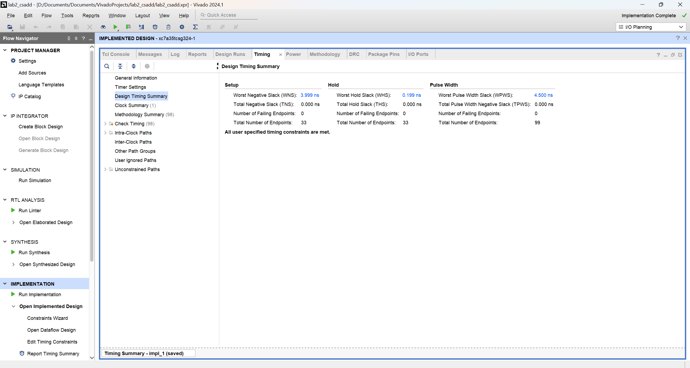
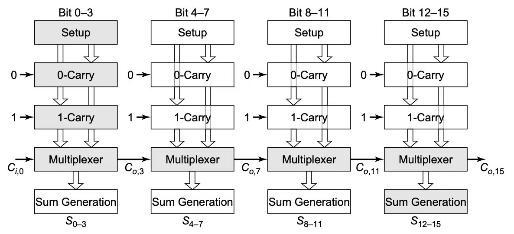

# 基于后仿真的数字逻辑电路性能分析

## 后仿真

后仿真是指在数字电路设计流程中，对版图设计完成后的电路进行的仿真。
这个过程中，会将寄生参数和互连延迟等物理信息反标到电路网表中，
以确保电路在实际硅片上的行为与设计要求相符合。后仿真的目的是验证电路在考虑了所有物理效应后，
是否仍然能够满足设计规格，包括时序要求和功能正确性。

## 实验原理

对于时序逻辑电路来说，由于有时钟
clk，我们可以直接测试时钟频率。而组合逻辑电路没有时钟，所以我们需要将组合逻辑电路包裹在一个测试模块中，才能测试组合逻辑模块的延迟。

简单而言，只要将待测试的组合逻辑电路的输入和输出分别连接到两组寄存器上，就能实现其时延的测试。
具体地说，当 clk
到达上升沿时，输入寄存器将值传递给组合逻辑电路进行运算，当下一个 clk
上升沿到来后，如果组合逻辑电路已经完成运算，那么输出寄存器将保存组合逻辑电路的输出值，
我们也可以得知待测试电路的延迟不超过当前的时钟周期；否则，输出的寄存器无法按时更新，则产生时序违例。
以下为测试加法器的Verilog代码，根据实际情况修改：

        module test_csadd32 (
            input  wire        clk,
            input  wire [31:0] a,
            input  wire [31:0] b,
            input  wire        ci,
            output reg  [31:0] s,
            output reg         co
        );
        
            reg  [31:0] a_reg;
            reg  [31:0] b_reg;
            reg         ci_reg;
            wire [31:0] s_wire;
            wire        co_wire;
        
            always @(posedge clk) begin
                a_reg  <= a;
                b_reg  <= b;
                ci_reg <= ci;
                s      <= s_wire;
                co     <= co_wire;
            end
        
            csadd32 cs (
                .a (a_reg),
                .b (b_reg),
                .ci(ci_reg),
                .s (s_wire),
                .co(co_wire)
            );
        endmodule

## 实验步骤

### 调整时钟频率

新建一个约束文件`clock.xdc`，粘贴如下代码：

    create_clock -add -name sys_clk_pin -period 10.00 -waveform {0 5} [get_ports {clk}];

这段代码的意思是，将 clk 端口设置为时钟信号，并将其时钟周期设置为
10ns，即 100MHz 的时钟频率。

### 评估电路性能

当我们对电路完成实现（Implementation）后，即可查看各种电路性能指标。

打开Flow Navigator，点击 Report Timing Summary
即可查看电路的时序信息，点击 Report Utilization
即可查看电路的资源使用情况。 在 .xdc 文件中设置时钟频率为 100MHZ，点击
Report Timing Summary 后，选择进位加法器的时序情况如下：

图中，Worst Negative Slack(WNS)
代表的是电路的最大延迟（即关键路径的延迟）与时钟周期之间的差距。 上图中
WNS 为 3.999ns，表明电路最大延迟至少还有 3.999ns 的裕量。Total Negative
Slack(TNS) 代表的是电路所有路径的延迟超时之和，
表征了电路的整体性能，它只会在 WNS
为负时才会是负的（我们一般不用考虑这个指标）。 我们可以在左侧选择
Intra-Clock
Paths/sys_clk_pin/Setup，这里会将路径按照延迟长短进行排序，Slack
代表的即为对应路径的延迟。

Logic Delay 和 Net Delay
分别代表路径的逻辑延迟和线网延迟，其中前者代表路径上的逻辑门导致的延迟之和，后者则表示板上布线带来的延迟。
由于信号是以电信号传输的，当线的长度越长，其线网延迟也越大。当电路设计的比较复杂时，Vivado
使用的资源量增多，难以在平面上布线，部分电线的长度较长，线网延迟可能就会升高。
双击路径（比如 Path
1）可以打开该条路径的详细时序信息，包括信号在路径上传输过程中到达各个节点时的总延迟。这可以提示我们电路中最耗时的是哪些部
分，指导我们针对哪些部分优化电路。

最终的结果应该为：逐位进位加法器的WNS明显小于选择进位加法器的WNS。

## 术语说明

### 时序违例和关键路径

时序违例是指，电路的最大延迟大于当前的时钟周期。此时，Vivado 会报出
Critical warning，但仍然可以上板。如下图：

需要尽可能避免时序违例，因为如果电路的最大延迟大于时钟周期，会导致在一个周期内，可能会有若干路径无法完成更新，从而使得整个电路的功能遭到破坏，行为朝着不可控的方向发展。
关键路径则是指电路中延迟最长的路径。我们知道，信号在电路中实际上是流式传输的，整个电路的最大延迟往往被某一条延迟最大的路径限制住------它往往也是我们优化电路代码，提高时钟频率的抓手之一。
如，本例中两个加法器的关键路径如下：

### 时序电路：性能计算公式

时序电路完成某个计算功能往往需要多个周期才能完成，对于它们的时间性能，我们往往使用公式
$T=N/f_{max}$
来衡量，其中，$N$为完成运算所需要的时钟周期数，$f_{max}$为电路的最大工作频率，
所以，$T$代表的是该时序电路完成一次计算总共需要的最小时间。完成相同任务的电路，$T$越小，说明电路完成任务花费的时间越少，电路的时间性能越好。

时钟周期一般需要通过仿真或分析代码确定，最大工作频率仍然可以类似组合电路的测试方法进行测试。区别是，时序电路由于已经含有
clk，不再需要设计测试模块，可以直接查看时序报告，确定最大工作频率。
由上面的叙述可见，电路的时间性能主要取决于其完成任务所需的时钟周期数与最大工作频率。所以，我们在优化电路时间性能时，往往可以从这两个方面入手，考虑如何减少其完成任务所需的时钟周期数，或者通过优化电路的结构，提高其最大工作频率。
