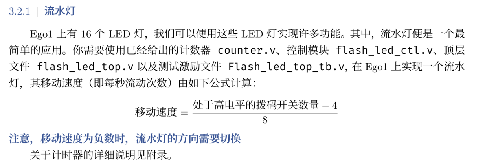

# 变速流水灯

> by 孙皓，张溪延，刘海强，胡璟晨曦

!> 来自助教的提醒：请勿抄袭，违纪者严肃处理！

## 必要知识

1. 100 MHz = $1\times 10^8$ Hz，即每秒的频率为 $1\times 10^8$ 次，一次的周期的时间为 $1\times10^{-8}$ s
2. EGO1 搭载 100MHz 的时钟芯片;时钟 clk 连接的管脚是 P17。
3. 在 Verilog 中直接使用数值，要标明其二进制下的位宽与进制，如十进制下的`10`，应该写为`4'd10`，其中`4`为`10`转化为二进制下的位宽，这个数字可以大于等于`4`，但一定不能小于`4`，因为`10`的二进制是`1010`，位宽为`4`，`d`为十进制，`10`为所表示的数值
4. 分频是将高频信号转为低频信号的过程，由于一个时钟的频率极快，人眼无法捕捉变化，因此我们要将频率变小，也就是将流水灯的变化速度变为人眼可捕捉的范围，我们采用计数器进行分频，对于每个周期进行一次计数，当计数达到指定数值输出高电平，以给出的分频器代码为例，其原理可以理解为将原来的一动一变，变成 $10001\times 10001$ 动一变（注意判断条件虽然是 $counter\_first/second==10000$，但实际上循环了 $10001$ 次）
```verilog
  always @(posedge clk or posedge rst) begin
    if (rst) 
        counter_first <= 14'd0;
    else 
        if (counter_first == 14'd10000) 
            counter_first <= 14'd0;
        else 
            counter_first <= counter_first +1;
  end

  always @(posedge clk or posedge rst) begin
    if (rst) 
        counter_second <= 14'd0;
    else        
        if (counter_second == 14'd10000) 
            counter_second <= 14'd0;
        else 
            if (counter_first == 14'd10000) 
            counter_second <= counter_second + 1;
  end
```
值得一提的是，在上面的代码中，分频器被拆分为`counter_first`与`counter_second`两个循环，这是因为 $10001\times 10001=100020001$ 这个数字十分庞大，如果单用一个循环，要使用一个 27 位宽的 reg 扮演迭代器的角色，而位宽越大，其性能越差，所以将其拆分为两个 14 位宽的迭代器`counter_first`与`counter_second`。
5. Verilog 中的除法要求为整数，所有变量默认无符号，进行减法操作注意溢出. ***注意，如无极特殊情况，请勿使用 verilog 的除法运算。***
6. `rst`复位信号通常以`rst_n`的形式出现，即平常置于高电平，当为低电平时复位，这主要是为了降低噪声，提高安全性.

## 实验过程

首先必须要注意的是，cg 平台上“流水灯的相关模块”和“按部就班”的流水灯代码是不足以完成本次实验的要求的，我们必须对原有代码做适当修改。实验的要求如下：


但是，若是您先把代码照搬再上板，那么可供操控的开关只有“复位”和“更改方向”两个。显而易见，既无法控制移动速度，也不能按照开关的“开闭数目”控制方向。因此，按照要求修改代码，似乎成为了我们的首要任务。  

我们分析“按部就班”的流水灯可以知道，此处给出的移动速度公式的正负号，充当了彼处的变量`dir`（`sw0`）的功能。也就是说，在方向上我们只需要判断“sum(‘1’处的开关数量) - 4”是否大于零就好。不过，此处就产生了一个坑点：在做加法器实验时我们知道，Verilog 里的变量是默认无符号的，于是我们需要将其先进行强制类型转换再比较。够了吗？还不够。

因为一个无符号变量即使减 4 之后也总是正，再去强制类型转换是无意义的，因此需要在定义时就要定义为有符号数。下图代码仅供参考：
```verilog
module flash_led_ctl(
    input clk,
    input rst,
    input clk_bps,
    input [7:0] ops,
    output reg [15:0] led
);

    wire signed [3:0] dir;
    assign dir = ((ops[0]+ops[1]+ops[2]+ops[3]+ops[4]+ops[5]+ops[6]+ops[7])-4);
```
当然，你也可以直接用默认的无符号数与 4 进行大小比较，不再过多赘述。
8 位`ops`代表了 8 个拨片开关，于是 4 位的有符号`wire`型`dir`就充当了移动速度的分子，也决定了移动方向（移动方向目前没有做明确规定，因此只要表现出反向，是正是负对应谁是随您喜欢的）。但是，假若您从一开始就将高电平开关数量和 4 进行比较，就省去了这些麻烦。
之后的过程无需赘述，无非是对给出的代码做修改和填空。如果您稍观察过`ctl`模块，应该会注意到分支语句是省略“ $\$signed(dir) == 0$ ”的。因为在时序电路中，如果敏感事件不发生时，状态保持——这恰恰满足了移动速度=0 的要求。

如果用原来的时钟，小灯的移动速度就是 $1\times 10^8$ . 很可惜，人类目前并没有进化到每秒能处理 100M 帧的肉眼，因此我们需要进行分频，计数大小为 $9999\times 9999$（倍数为 $10000\times 10000$）。这样我们就会惊喜地发现，时钟目前的周期正好是 1s（带着惊喜去计算一下也能得到相同的结果）——在不加干预的情况下，板上的小灯的移动速度就是 1。倘若现在要将移动速度变成 1/8 呢？答案就显而易见：变成 $10000\times 10000\times 8$ 动一变。
这样我们的终级目标就浮出水面了：将移动速度变成 t/8，就要将分频的频率变成原来的 $10000\times 10000\times 8/t$。这里的 t 就是上文 dir 的绝对值，而且绝对不会出现小数和除数为 0 的情况。为了保险，您可以运用三目运算符先转换一下再去运算。
```verilog
module counter(
    input wire clk,
    input wire rst,
    input [7:0] ops,
    output wire clk_bps
);
    reg [20:0] cnt_first, cnt_second;
    wire signed [3:0] dir;
    wire [3:0] un_dir;
    assign dir = ((ops[0]+ops[1]+ops[2]+ops[3]+ops[4]+ops[5]+ops[6]+ops[7])-4);
    assign un_dir = (dir >= 0 ? dir : (4-(ops[0]+ops[1]+ops[2]+ops[3]+ops[4]+ops[5]+ops[6]+ops[7])));
```
这里还有两点容易失足掉坑：其一是（ $\times 8 / un\_dir$）的操作只需要在`cnt_first`, `cnt_second`其中一个进行操作就好，不然就是平方倍。其二是由于`cnt_first`, `cnt_second`只有 14 位，直接放大 8 倍是一定会溢出的；这里我建议将位宽开得大一点。但是，乘除法运算在 FPGA 里本身较复杂，且占用时间空间都比较大。为了快速稳定地得到期望的结果，您不妨将普通的乘法改为左移三位；当然，你也可以只用一个循环完成，不再过多赘述。

最后，关于顶层模块，请务必要将声明的变量和实例化一一对应且不重不漏——大部分网表生成失败都是这个原因！如果还是失败的话，请尝试将一些底层模块不在括号里声明的变量重新在顶层声明一遍或者再检查是否有将数组声明成单个变量的情况。

在紧张刺激的综合上板的过程中，也有一些可能会卡住进度的情况。

+ 直接在 Verilog 代码上修改时间精度和最小时间单位会出现一些不可预料的情况，并且如果各个模块时间不统一，大概率得不到想要的结果。
+ I/O Ports 只能在您生成网表后才能在 Window 栏中找到。

如果管脚匹配错误，生成比特流时会直接报错。

+ 关于 Reset 是否保留的问题，如果没有规定，应该是自便的。这里我用匹配了旁边的 S2 开关，除了需要一直按着以外，没有别的坏处。
+ 您的拨片开关可以选择 8 个或者 16 个。
+ 如果您仔细阅读过底层模块就会发现：给定的复位开关 rst 似乎和上课时的复位代码正好相反。原本的 if( !rst )变成了 if( rst )——但为什么波形和在板子上的操作和课上的代码一致呢？答案就隐藏在顶层模块中。
```verilog
assign rst = ~rst_n;
```
如果您觉得这样写别扭，请将仿真模块中的 rst 一并改掉——或者为了巩固复位的知识，您可以将这些 rst 的正负进行各种排列组合，再去观察它们之间有什么不同。
