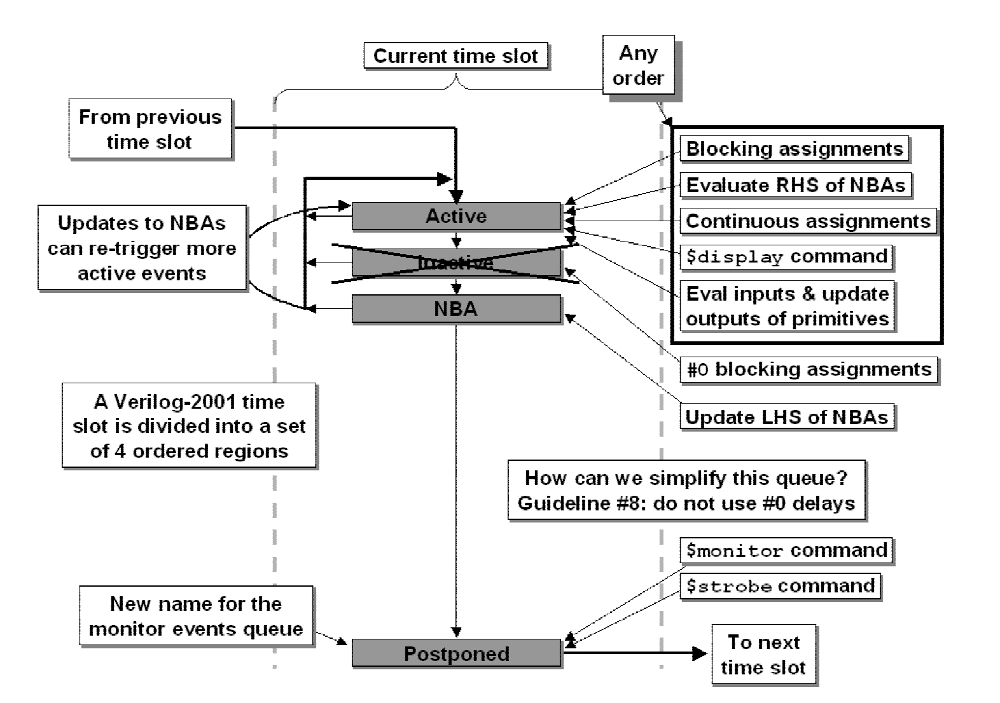
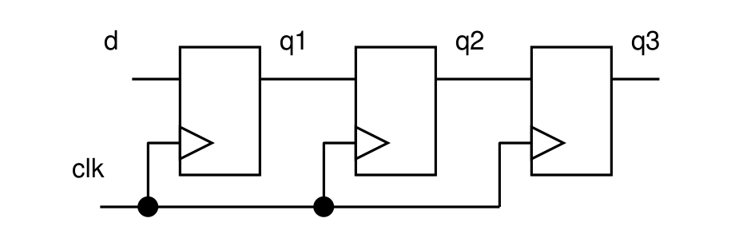
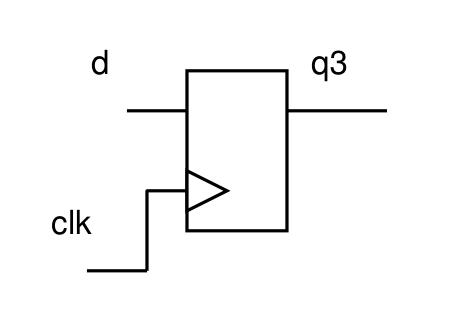

# Verilog综合中的赋值与代码风格

> 本文是 Cummings, Clifford. (2000). Nonblocking Assignments in Verilog Synthesis, Coding Styles That Kill. 一文的非官方中文概述。 - by kevin

## 简介

编写Verilog有两条众所周知的准则：

+ 在组合逻辑块中使用阻塞赋值；
+ 在时序逻辑块中使用非阻塞赋值。

虽然不按照上述方法编写Verilog依然可以生成 **正确的** 电路，但 **可能** 会导致仿真与综合结果 **不一致** 。

## 冒险与竞争

在Verilog中存在两种语句：保证执行顺序的，和不保证执行顺序的。当多个不保证执行顺序的语句在同一个仿真周期执行时，就会产生冒险。

## 阻塞赋值

阻塞赋值的操作符是`=`。阻塞赋值之所以叫阻塞赋值，正是因为对于阻塞赋值来说，一个形如`LHS = RHS;`的语句必须首先计算`RHS`，并且立刻（不可被其他语句中断）赋值给`LHS`后才能继续执行其他语句。对于一个块中的多个阻塞赋值语句，一定是按代码顺序执行的。但是对于多个块而言，如果一个块中的`RHS`变量同时是另一个块中的`LHS`变量，那么就会出现冒险现象。

```verilog
module fbosc1 (y1, y2, clk, rst);
    output y1, y2;
    input  clk, rst;
    reg    y1, y2;

    always @(posedge clk or posedge rst) begin : blk1
        if (rst) y1 = 0; // reset
        else     y1 = y2;
    end

    always @(posedge clk or posedge rst) begin : blk2
        if (rst) y2 = 1; // preset
        else     y2 = y1;
    end
endmodule
```

上述代码中，`blk1`和`blk2`两个always块的执行顺序是任意的。在`rst`后第一个时钟上升沿到来时，`y1 = 0; y2 = 1`，执行顺序可以是：

```verilog
y1 = 1  // blk1 first
y2 = y1 // blk2 second
```

也可以是：

```verilog
y2 = 0  // blk2 first
y1 = y2 // blk1 second
```

这样，就会产生两种执行结果：`y1 = 1; y2 = 1`或`y1 = 0; y2 = 0`。由此产生了一次冒险。

## 非阻塞赋值

阻塞赋值的操作符是`<=`。非阻塞赋值之所以叫非阻塞，正是因为对于它来说，一个形如`LHS <= RHS;`的语句不会影响其他语句的执行，也就是说，`RHS`可以被其他语句更新。非阻塞赋值语句本身只会在一个仿真周期的结束时被执行。

非阻塞赋值只可以对`reg`类型使用，因此也就只能出现在过程块中。

```verilog
module fbosc2 (y1, y2, clk, rst);
    output y1, y2;
    input  clk, rst;
    reg    y1, y2;

    always @(posedge clk or posedge rst) begin : blk1
        if (rst) y1 <= 0; // reset
        else     y1 <= y2;
    end

    always @(posedge clk or posedge rst) begin : blk2
        if (rst) y2 <= 1; // preset
        else     y2 <= y1;
    end
endmodule
```

上述代码中，在`rst`后第一个时钟上升沿到来时，`y1 = 0; y2 = 1`。无论`blk1`和`blk2`两个always块的执行顺序如何，由于`y1`和`y2`的更新时间是一个仿真周期的结束，此时依旧有`y1 = 0; y2 = 1`，因此执行结果是确定的：`y1 = 1; y2 = 0`。在用户角度上看，这两个`blk`是并行执行的。

## Verilog代码准则

1. 对于时序逻辑，使用非阻塞赋值；
2. 对于锁存器，使用非阻塞赋值；
3. 对于在always块中的组合逻辑，使用阻塞赋值；
4. 在相同的always块中的时序和组合逻辑，使用非阻塞赋值；
5. 不要在相同的always块中混用阻塞和非阻塞赋值；
6. 不要在多个always块中对同一个变量赋值；
7. 使用`$strobe`显示已经被非阻塞赋值的变量；
8. 不要使用`#0`延迟进行赋值。

## Verilog分层事件队列



在 *active envents* 队列中，阻塞赋值、持续赋值、`$display`、输入、原语输出的更新与非阻塞赋值`RHS`部分的计算等大部分Verilog事件都将被规划执行时间（为了语言上的简便，后续将称其为"执行"）。注意，非阻塞赋值`LHS`的更新不在此列。

在 *nonblocking assign updates* 队列中，非阻塞赋值`LHS`变量的更新被规划。

在 *monitor* 队列中，`$strobe`和`$monitor`会被执行。此队列位于所有赋值语句更新完成后。

在 *inactive* 队列中，`#0`延迟的赋值会被执行。虽然`#0`延迟赋值可以手工指定两个always块中阻塞赋值的顺序，**但会徒增复杂度，且可以被其他更有效的代码替换**。

因此说明了第八条准则：

8. 不要使用`#0`延迟进行赋值。

## 自触发always块

一般来说，我们不会遇到自触发always块。以下列代码为例：

```verilog
module osc1 (clk);
    output clk;
    reg clk;

    initial #10 clk = 0;

    always @(clk) #10 clk = ~clk;
endmodule
```

阻塞赋值会在`@(clk)`前执行，即`RHS`的更新在`@(clk)`前，因此在`@(clk)`被执行时，`clk`已经被赋值，因此这个always块中的阻塞赋值语句不会自触发。

但观察以下例子：

```verilog
module osc2 (clk);
    output clk;
    reg clk;

    initial #10 clk = 0;

    always @(clk) #10 clk <= ~clk;
endmodule
```

非阻塞赋值`LHS`的更新不在 *active envents* 队列中，而在其后的 *nonblocking assign updates* 队列。在 *nonblocking assign updates* 队列被执行前，`@(clk)`已经在 *active envents* 队列中被执行，此时`clk`变为敏感信号，任何对`clk`的修改将会触发`@(clk)`。当仿真程序开始执行 *nonblocking assign updates* 队列时，`LHS`，也就是`clk`被更新，`@(clk)`被触发。此时又将回到最开始的情况，不断震荡。所以这个always块中的非阻塞赋值是自触发的。因此不要用这种代码风格。

## 流水线



上图是一个流水线寄存器。下面我们将会展示四种描述这个流水线寄存器的方式：

首先是下列代码：

```verilog
module pipeb1 (q3, d, clk);
    output [7:0] q3;
    input  [7:0] d;
    input        clk;
    reg    [7:0] q3, q2, q1;

    always @(posedge clk) begin
        q1 = d;
        q2 = q1;
        q3 = q2;
    end
endmodule
```

如之前所说，一个always块中的阻塞赋值语句按序执行。因此

```verilog
q1 = d;
q2 = q1; // (= d)
q3 = q2; // (= q1 (= d))
```

也就是说这段代码最后的执行结果是`q1 = q2 = q3 = d`，如下图所示：



在下面的例子中，我们依旧使用阻塞赋值，但是其顺序经过了精心的设计。

```verilog
module pipeb2 (q3, d, clk);
    output [7:0] q3;
    input  [7:0] d;
    input        clk;
    reg    [7:0] q3, q2, q1;

    always @(posedge clk) begin
        q3 = q2;
        q2 = q1;
        q1 = d;
    end
endmodule
```

如之前所说，一个always块中的阻塞赋值语句按序执行。因此

```verilog
q3 = q2;
q2 = q1;
q1 = d;
```

这样描述可以实现一个正确的流水线寄存器，但代码风格**非常差**。

接下来，我们考虑第三和第四种描述方式：

```verilog
module pipeb3 (q3, d, clk);
    output [7:0] q3;
    input  [7:0] d;
    input        clk;
    reg    [7:0] q3, q2, q1;

    always @(posedge clk) q1 = d;

    always @(posedge clk) q2 = q1;

    always @(posedge clk) q3 = q2;
endmodule
```

```verilog
module pipeb4 (q3, d, clk);
    output [7:0] q3;
    input  [7:0] d;
    input        clk;
    reg    [7:0] q3, q2, q1;

    always @(posedge clk) q2 = q1;

    always @(posedge clk) q3 = q2;

    always @(posedge clk) q1 = d;
endmodule
```

由于Verilog中多个的always块执行顺序是不确定的，现在真的成了一团浆糊了。一切赋值顺序的排列组合均有可能。也可能出现仿真正确，上版不过的情况。

但是同样方式，使用非阻塞赋值描述的流水线寄存器都是正确的：

```verilog
module pipeb1 (q3, d, clk);
    output [7:0] q3;
    input  [7:0] d;
    input        clk;
    reg    [7:0] q3, q2, q1;

    always @(posedge clk) begin
        q1 <= d;
        q2 <= q1;
        q3 <= q2;
    end
endmodule
```

```verilog
module pipeb2 (q3, d, clk);
    output [7:0] q3;
    input  [7:0] d;
    input        clk;
    reg    [7:0] q3, q2, q1;

    always @(posedge clk) begin
        q3 <= q2;
        q2 <= q1;
        q1 <= d;
    end
endmodule
```

```verilog
module pipeb3 (q3, d, clk);
    output [7:0] q3;
    input  [7:0] d;
    input        clk;
    reg    [7:0] q3, q2, q1;

    always @(posedge clk) q1 <= d;

    always @(posedge clk) q2 <= q1;

    always @(posedge clk) q3 <= q2;
endmodule
```

```verilog
module pipeb4 (q3, d, clk);
    output [7:0] q3;
    input  [7:0] d;
    input        clk;
    reg    [7:0] q3, q2, q1;

    always @(posedge clk) q2 <= q1;

    always @(posedge clk) q3 <= q2;

    always @(posedge clk) q1 <= d;
endmodule
```

由此可见，在时序逻辑中使用非阻塞赋值是更好的习惯。上述所有非阻塞赋值的写法都可以保证仿真、综合正确。而阻塞赋值的写法则不然：第一种写法仿真与综合均不正确；第二种写法仿真正确，综合也正确；第三和第四种写法综合是正确的（但并不代表是你想要的结果），但仿真不正确（虽然这个不正确的结果有时候正是你需要的）。

## 阻塞赋值举例

以下是一种正确的，但不是很好的D触发器写法：

```verilog
module dffb (q, d, clk, rst);
    output q;
    input  d, clk, rst;
    reg    q;

    always @(posedge clk)
        if (rst) q = 1'b0;
        else     q = d;
endmodule
```

我们更推荐使用非阻塞赋值来描述一个触发器：

```verilog
module dffx (q, d, clk, rst);
    output q;
    input  d, clk, rst;
    reg    q;

    always @(posedge clk)
        if (rst) q <= 1'b0;
        else     q <= d;
endmodule
```

我们推荐 ***无论何种时序逻辑块，均使用非阻塞赋值***。这样可以有效避免仿真与综合不一致。

## 带有反馈的时序逻辑

虽然你可能认为阻塞赋值的顺序只要经过精心排列就可以实现和时序赋值一样的功能，但现实总是残酷的。以线性反馈移位寄存器（LFSR，可以理解为一种输入依赖自身输出的寄存器）举例：

```verilog
module lfsrb1 (q3, clk, pre_n);
    output q3;
    input  clk, pre_n;
    reg    q3, q2, q1;
    wire   n1;

    assign n1 = q1 ^ q3;

    always @(posedge clk or negedge pre_n)
        if (!pre_n) begin
            q3 = 1'b1;
            q2 = 1'b1;
            q1 = 1'b1;
        end
        else begin
            q3 = q2;
            q2 = n1;
            q1 = q3;
        end
endmodule
```

你会发现无论如何你都无法用阻塞赋值正确实现其功能。如果你发现可以用拼接运算符`{}`来拼接多个变量，形成如下代码可以实现其功能时，

```verilog
module lfsrb2 (q3, clk, pre_n);
    output q3;
    input clk, pre_n;
    reg q3, q2, q1;

    always @(posedge clk or negedge pre_n)
        if (!pre_n) {q3,q2,q1} = 3'b111;
        else        {q3,q2,q1} = {q2,(q1^q3),q3};
endmodule
```

你是对的，但最好不要这么做。这样会带来很多调试上的麻烦，当赋值语句左右两侧有几十上百个信号的时候更是如此。因为你可以使用非阻塞赋值来轻松实现同样的功能：

```verilog
module lfsrn1 (q3, clk, pre_n);
    output q3;
    input  clk, pre_n;
    reg    q3, q2, q1;
    wire   n1;

    assign n1 = q1 ^ q3;

    always @(posedge clk or negedge pre_n)
        if (!pre_n) begin
            q3 <= 1'b1;
            q2 <= 1'b1;
            q1 <= 1'b1;
        end
        else begin
            q3 <= q2;
            q2 <= n1;
            q1 <= q3;
        end
endmodule
```

```verilog
module lfsrb2 (q3, clk, pre_n);
    output q3;
    input clk, pre_n;
    reg q3, q2, q1;

    always @(posedge clk or negedge pre_n)
        if (!pre_n) {q3,q2,q1} <= 3'b111;
        else        {q3,q2,q1} <= {q2,(q1^q3),q3};
endmodule
```

这就说明了第一条和第二条准则：

1. 对于时序逻辑，使用非阻塞赋值；
2. 对于锁存器，使用非阻塞赋值。

## 组合逻辑使用非阻塞赋值

```verilog
module ao4 (y, a, b, c, d);
    output y;
    input  a, b, c, d;
    reg    y, tmp1, tmp2;

    always @(a or b or c or d) begin
        tmp1 <= a & b;
        tmp2 <= c & d;
        y    <= tmp1 | tmp2;
    end
endmodule
```

上述代码的意图可以看出是令输出`y = a & b | c & d`，而实际结果却只会是`y = tmp1 | tmp2`，且`tmp1`和`tmp2`是旧值，并非`a & b`和`c & d`，因为敏感表中不包含`tmp1`和`tmp2`，因此在非阻塞赋值的`LHS`更新时，不会再次触发这个always块，从而造成输出不符合预期。

那么容易想到添加额外的敏感信号到敏感表中，如下列代码所示：

```verilog
module ao5 (y, a, b, c, d);
    output y;
    input  a, b, c, d;
    reg    y, tmp1, tmp2;

    always @(a or b or c or d or tmp1 or tmp2) begin
        tmp1 <= a & b;
        tmp2 <= c & d;
        y    <= tmp1 | tmp2;
    end
endmodule
```

这样可以正确实现其功能，但正如前面所提到的，这样会导致自触发，是一种 **不好的** 代码风格。

而使用阻塞赋值就可以很轻松地完成这个逻辑：

```verilog
module ao5 (y, a, b, c, d);
    output y;
    input  a, b, c, d;
    reg    y, tmp1, tmp2;

    always @(a or b or c or d) begin
        tmp1 = a & b;
        tmp2 = c & d;
        y    = tmp1 | tmp2;
    end
endmodule
```

这说明了准则三：

3. 对于在always块中的阻塞逻辑，使用阻塞赋值；

## 组合与时序逻辑混合使用非阻塞赋值

当一个always块中同时出现了时序与组合逻辑，那么需要使用非阻塞赋值。如下列代码所示：

```verilog
module nbex2 (q, a, b, clk, rst_n);
    output q;
    input  clk, rst_n;
    input  a, b;
    reg    q;

    always @(posedge clk or negedge rst_n)
        if (!rst_n) q <= 1'b0;
        else        q <= a ^ b;
endmodule
```

?> 其中`a ^ b`是组合逻辑。

这个代码也可以拆分为如下形式：

```verilog
module nbex1 (q, a, b, clk, rst_n);
    output q;
    input  clk, rst_n;
    input  a, b;
    reg    q, y;
    
    always @(a or b)
        y = a ^ b;
    
    always @(posedge clk or negedge rst_n)
        if (!rst_n) q <= 1'b0;
        else        q <= y;
endmodule
```

因此为了方便起见，有准则四：

4. 在相同的always块中的时序和组合逻辑，使用非阻塞赋值；

## 其他混合赋值情况

如果你想要在一个always块中同时使用阻塞和非阻塞赋值，如下列代码：

```verilog
module ba_nba2 (q, a, b, clk, rst_n);
    output q;
    input  a, b, rst_n;
    input  clk;
    reg    q;

    always @(posedge clk or negedge rst_n) begin: ff
        reg tmp;
        if (!rst_n) q <= 1'b0;
        else begin
            tmp = a & b;
            q <= tmp;
        end
    end
endmodule
```

还是建议你停止这个可怕的想法。虽然这是正确的，但风格实在太差，会给debug和调试带来巨大的麻烦。

如果你想用下列形式的代码：

```verilog
module ba_nba6 (q, a, b, clk, rst_n);
    output q;
    input a, b, rst_n;
    input clk;
    reg q, tmp;

    always @(posedge clk or negedge rst_n)
        if (!rst_n) q = 1'b0; // blocking assignment to "q"
        else begin
            tmp = a & b;
            q <= tmp; // nonblocking assignment to "q"
    end
endmodule
```

很可惜，由于在一个always块中对一个变量同时使用阻塞和非阻塞赋值，这份代码的语法是错误的。

由此引出了第五条准则：

5. 不要在相同的always块中混用阻塞和非阻塞赋值；

## 对一个变量的多重赋值（多驱动）

```verilog
module badcode1 (q, d1, d2, clk, rst_n);
    output q;
    input  d1, d2, clk, rst_n;
    reg    q;

    always @(posedge clk or negedge rst_n)
        if (!rst_n) q <= 1'b0;
        else        q <= d1;

    always @(posedge clk or negedge rst_n)
        if (!rst_n) q <= 1'b0;
        else        q <= d2;
endmodule
```

考虑以上代码，在两个always块中对`q`进行了多次赋值，将会产生"多驱动"的警告，同时产生冒险。如果不加处理，Vivado将会在生成比特流时报错。

因此有准则六：

6. 不要在多个always块中对同一个变量赋值；

## 非阻塞赋值的迷思（myths）

### 非阻塞赋值和`$display`

`$display`会在所有非阻塞赋值更新前输出。下列代码`$display`将会输出`0`，其他两条指令则输出`1`。

```verilog
module display_cmds;
    reg a;

    initial $monitor("\$monitor: a = %b", a);

    initial begin
        $strobe ("\$strobe : a = %b", a);
        a = 0;
        a <= 1;
        $display ("\$display: a = %b", a);
        #1 $finish;
    end
endmodule
```

### `#0`延迟赋值

`#0`延迟赋值在 *inactive events queue* 中被执行，在 *non blocking assign update* 之前。因此下列代码

```verilog
module nb_schedule1;
    reg a, b;

    initial begin
        a = 0;
        b = 1;
        a <= b;
        b <= a;

           $monitor ("%0dns: \$monitor: a=%b b=%b", $stime, a, b);
           $display ("%0dns: \$display: a=%b b=%b", $stime, a, b);
           $strobe ("%0dns: \$strobe : a=%b b=%b\n", $stime, a, b);
        #0 $display ("%0dns: #0 : a=%b b=%b", $stime, a, b);

        #1 $monitor ("%0dns: \$monitor: a=%b b=%b", $stime, a, b);
           $display ("%0dns: \$display: a=%b b=%b", $stime, a, b);
           $strobe ("%0dns: \$strobe : a=%b b=%b\n", $stime, a, b);
           $display ("%0dns: #0 : a=%b b=%b", $stime, a, b);

        #1 $finish;
    end
endmodule
```

的输出是：

```text
    0ns: $display: a=0 b=1
    0ns: #0 : a=0 b=1
    0ns: $monitor: a=1 b=0
    0ns: $strobe : a=1 b=0

    1ns: $display: a=1 b=0
    1ns: #0 : a=1 b=0
    1ns: $monitor: a=1 b=0
    1ns: $strobe : a=1 b=0
```

由此有准则七：

7. 使用`$strobe`显示已经被非阻塞赋值的变量；

### 多重非阻塞赋值

对于如下代码所示的多重非阻塞赋值而言，源代码顺序上最后一个赋值有效：

```verilog
initial begin
    a <= 0;
    a <= 1;
end
```

即`a <= 1`有效。
